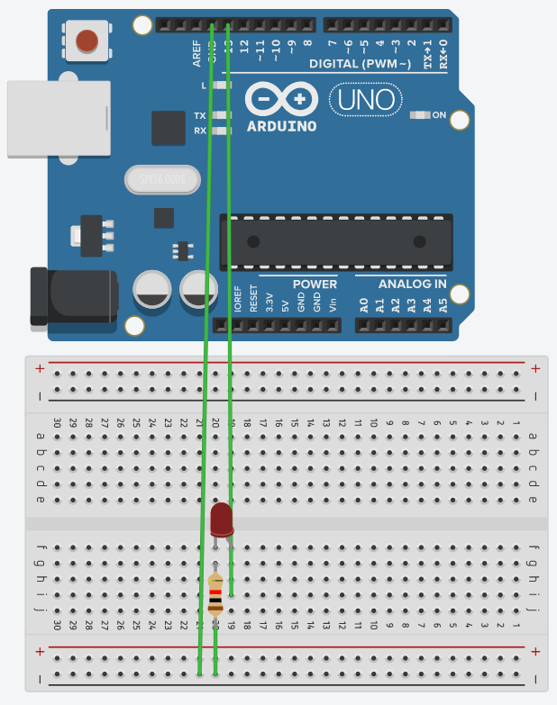

# Simple Led Auto Blink
Project for learning the basics about arduino

## Components

* [About the Project](#about-the-project)
* [Getting Started](#getting-started)
* [Components](#components)

## About The Project
This project was developed for learning the Arduino platform. It contains simple concepts of structured programming and electronics. The language used is C, native to the Arduino platform.

## Getting Started
To start this project you must have an IDE to write your code and compile for your Arduino, you can use the online platform or download the correct IDE for your operational system from the official website.
* [Online Arduino Editor](https://create.arduino.cc/editor)
* [IDE Download Link](https://www.arduino.cc/en/Main/Software#download)

## Components
The components used on this project were.
* 1x Arduino Board
* 1x Led
* 1x 200 ohms resistor
* 1x Protoboard
* 2x Jumper wire male to male

## Project Schematic

